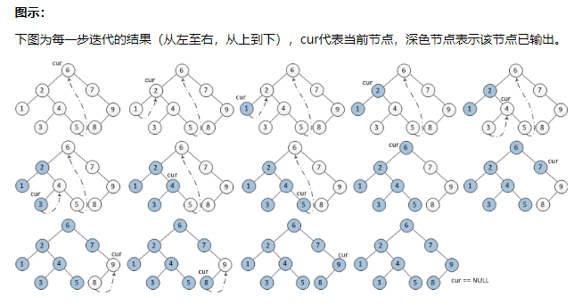

# 99. Recover Binary Search Tree [hard]     
Two elements of a binary search tree (BST) are swapped by mistake.      
Recover the tree without changing its structure.      

Example 1:     
Input: [1,3,null,null,2]      
   1    
  /   
 3    
  \    
   2     
   
Output: [3,1,null,null,2]       
   3   
  /   
 1    
  \    
   2    
   
Example 2:     
Input: [3,1,4,null,null,2]      
  3    
 / \    
1   4     
   /    
  2    
Output: [2,1,4,null,null,3]     
  2    
 / \    
1   4    
   /    
  3    
  
Follow up:     
A solution using O(n) space is pretty straight forward.    
Could you devise a constant space solution?      


## Solution     
### 1. Morris Traversal (Finds two Incorrect Pointer)    
It take use of leaf nodes' right/left pointer to achieve O(1) space Traversal on a Binary Tree.    
Below is a standard Inorder Morris Traversal, referred from http://www.cnblogs.com/AnnieKim/archive/2013/06/15/morristraversal.html (a Chinese Blog, while the graphs are great for illustration)      
```
public void recoverTree(TreeNode root) {
        TreeNode pre = null;
        TreeNode first = null, second = null;
        // Morris Traversal
        TreeNode temp = null;
		while(root!=null){
			if(root.left!=null){
				// connect threading for root
				temp = root.left;
				while(temp.right!=null && temp.right != root)
					temp = temp.right;
				// the threading already exists
				if(temp.right!=null){
				    if(pre!=null && pre.val > root.val){
				        if(first==null){first = pre;second = root;}
				        else{second = root;}
				    }
				    pre = root;
				    
					temp.right = null;
					root = root.right;
				}else{
					// construct the threading
					temp.right = root;
					root = root.left;
				}
			}else{
				if(pre!=null && pre.val > root.val){
				    if(first==null){first = pre;second = root;}
				    else{second = root;}
				}
				pre = root;
				root = root.right;
			}
		}
		// swap two node values;
		if(first!= null && second != null){
		    int t = first.val;
		    first.val = second.val;
		    second.val = t;
		}
    }
}
```

#### 中序遍历    
中序遍历步骤：     
1. 如果当前节点的左孩子为空，则输出当前节点并将其右孩子作为当前节点。   

2. 如果当前节点的左孩子不为空，在当前节点的左子树中找到当前节点在中序遍历下的前驱节点。    

   a) 如果前驱节点的右孩子为空，将它的右孩子设置为当前节点。当前节点更新为当前节点的左孩子。    

   b) 如果前驱节点的右孩子为当前节点，将它的右孩子重新设为空（恢复树的形状）。输出当前节点。当前节点更新为当前节点的右孩子。    

3. 重复以上1、2直到当前节点为空。     

空间复杂度：O(1)，因为只用了两个辅助指针。   

时间复杂度：O(n)。   

    


### 2. use stack (to do in-order traversal)    
In the processing of traversal, keep comparing the current value with the previous value. Since each previous value should be less than the current value, once an exception is found, record the previous node as the First Mistaken Node and the current node as Second. If one more exceptions are found, override the current node to the Second Mistaken Node. Because if a series of mistaken nodes are found, the only possible way to correct them with one swap is to switch the head and tail node.      
```
public void recoverTree(TreeNode root) {
	TreeNode pre = null, first = null, second = null;
	Deque<TreeNode> stack = new LinkedList<TreeNode>();
	while (root != null) {
		stack.push(root);
		root = root.left;
	}
	while (!stack.isEmpty()) {
		TreeNode temp = stack.pop();
		if (pre != null)
			if (pre.val > temp.val) {
				if (first == null)
					first = pre;
				second = temp;
			}
		pre = temp;
		if (temp.right != null) {
			temp = temp.right;
			while (temp != null) {
				stack.push(temp);
				temp = temp.left;
			}
		}
	}

	int temp = first.val;
	first.val = second.val;
	second.val = temp;
}
```


### Failed but nice 3. simple in-order traversal    
in-order: pre, root, post    

start by writing the in order traversal:      
```
private void traverse (TreeNode root) {
   if (root == null)
      return;
   traverse(root.left);
   // Do some business
   traverse(root.right);
}
```
What is the business we are doing here?     
We need to find the first and second elements that are not in order right?     

How do we find these two elements? For example, we have the following tree that is printed as in order traversal:    
6, 3, 4, 5, 2     
We compare each node with its next one and we can find out that 6 is the first element to swap because 6 > 3 and 2 is the second element to swap because 2 < 5.    

Really, what we are comparing is the current node and its previous node in the "in order traversal".      

Let us define three variables, firstElement, secondElement, and prevElement. Now we just need to build the "do some business" logic as finding the two elements. See the code below:     
```
public class Solution {
    
    TreeNode firstElement = null;
    TreeNode secondElement = null;
    // The reason for this initialization is to avoid null pointer exception in the first comparison when prevElement has not been initialized
    TreeNode prevElement = new TreeNode(Integer.MIN_VALUE);
    
    public void recoverTree(TreeNode root) {
        
        // In order traversal to find the two elements
        traverse(root);
        
        // Swap the values of the two nodes
        int temp = firstElement.val;
        firstElement.val = secondElement.val;
        secondElement.val = temp;
    }
    
    private void traverse(TreeNode root) {
        
        if (root == null)
            return;
            
        traverse(root.left);
        
        // Start of "do some business", 
        // If first element has not been found, assign it to prevElement (refer to 6 in the example above)
        if (firstElement == null && prevElement.val >= root.val) {
            firstElement = prevElement;
        }
    
        // If first element is found, assign the second element to the root (refer to 2 in the example above)
        if (firstElement != null && prevElement.val >= root.val) {
            secondElement = root;
        }        
        prevElement = root;

        // End of "do some business"

        traverse(root.right);
    }
    
}
```

But this solution will actually fail in below situation:
[5,3,9,-2147483648,2]

Actual Output:
[5,3,9,-2147483648,-2147483648]
Expected:
[5,2,9,-2147483648,3]


